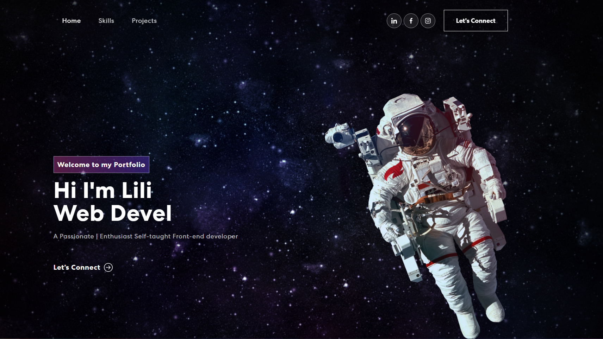
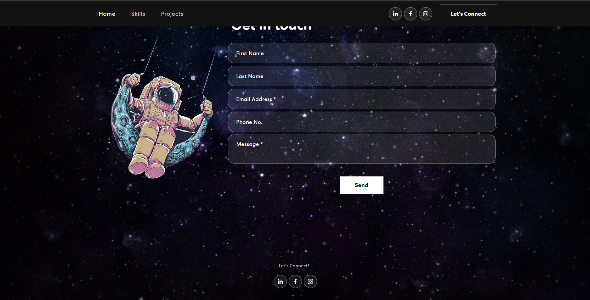

## <h1 align="center">⚡Porfolio - Lilian Taschini</h1> 

Felíz de tenerlo productivo
 

Te invito a ver mi porfolio, al que le metí muchas ganas.

 

## 💻 Tecnologías Utilizadas 

## 🌼 URL 
Para interactuar con la plataforma web por favor accede a: <a href="https://lilian-antonella-taschini.netlify.app/" target="_blank">⚡Porfolio - Lilian Taschini</a>

## 💟 Preview
  

   
    
  

## 🛠 Cómo usar
¡Hola!
Hoy estoy felíz de publicar mi porfolio, en el mismo podrás ver mi Tech Stack, algunos de mis proyectos, y contactarme en el caso de que así lo desees.
El mismo cuenta con un diseño responsive para adaptarse a todo tipo de dispositivos. 
No dudes por favor, en enviarme ideas o recomendaciones de mejora del mismo, te lo agradeceré muchisimo.
De igual manera, si estas interesado en que te hable de alguna funcionalidad, no dudes en consultarme.

## ⚙ Otros Recursos Utilizados
También usé Bootstrap y Email.JS para gestionar el CONTACTAME

## Estado del Proyecto
 En Desarrollo.
 Como toda creación propia, me encontraré siempre mejorándolo y buscando que sea más vistozo. 

